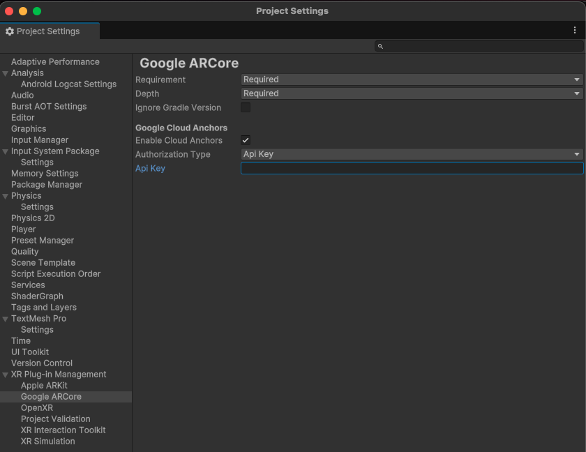

# Persistent anchors

This page is a supplement to the AR Foundation [Persistent Anchors](xref:arfoundation-anchors-persistent) manual. The following sections only contain information about APIs where ARCore exhibits unique platform-specific behavior.

[!include]

Persistent anchors for ARCore utilizes [Google Cloud](https://cloud.google.com/docs/get-started). To use persistent anchor functionality, you must first set up a Google Cloud project to store persistent anchor data. ARCore persistent anchors are subject to [Usage quotas](https://developers.google.com/ar/develop/c/cloud-anchors/developer-guide#api_quotas_for_host_and_resolve_requests) (Google's ARCore documentation).

When working with persistent anchors, refer to ARCore's [Best practices](https://developers.google.com/ar/develop/c/cloud-anchors/developer-guide#best_practices_for_a_good_user_experience).

## Check for persistent anchor support

You can use the following code to check whether your system supports persistent anchors:

[!code-cs[CheckPersistentAnchorsSupport](../../../Tests/Runtime/CodeSamples/ARCoreAnchorSubsystemTests.cs#CheckPersistentAnchorsSupport)]

## Configure your project to use persistent anchors

To use persistent anchors on ARCore, you must first authorize your application so that it can save anchor data to Google Cloud. Refer to the ARCore [Use the ARCore API on Google Cloud](https://developers.google.com/ar/develop/authorization?platform=android) documentation to understand how to set up authorization for your project.

Once you have authorized your application, you can then set up your project to use persistent anchors. To configure your project to use persistent anchors:

1. Follow Google's instructions to [Create a Google Cloud project](https://developers.google.com/ar/develop/authorization?platform=android#create_a_new_google_cloud_project_or_use_an_existing_project) and enable [ARCore APIs](https://developers.google.com/ar/develop/authorization?platform=android#enable_the_arcore_api).
2. In the **Google ARCore** settings of **XR Plug-in Management**, select **Enable Cloud Anchors**.
3. Select the **Authorization Type** that matches the authorization you set up for your project on Google Cloud.
4. If you used the API Key method, enter the **API Key**.
5. If you used the Keyless method, follow the additional steps in [Configure Keyless authentication](#configure-keyless-authentication).

 *ARCore Cloud Anchor settings.*

### Configure Keyless authentication

To configure your project to use persistent anchors using Keyless authentication, follow these additional steps:

1. Navigate to the **Player Settings** (menu: **Edit** > **Project Settings** > **Player**) and in the **Android** tab, expand **Publishing Settings**.
2. Under **Publishing Settings**, enable **Custom Keystore**.
3. Use the **Keystore Manager** to create a new keystore as outlined in [Create a new keystore](https://docs.unity3d.com/Manual/android-keystore-create.html).
4. Establish appropriate OAuth2 credentials as outlined in the **Create OAuth 2.0 client IDs** section of Google's [ARCore documentation](https://developers.google.com/ar/develop/authorization?platform=android#enable_the_arcore_api). Ensure that the package name, and the keystore SHA1 fingerprint are exact, with no extra spaces or characters in the OAuth credentials setup fields.
5. Use the command line tool to determine the fingerprint for OAuth credentials, as outlined in the **How to obtain a signing fingerprint from a keystore** section of [Google's ARCore documentation](https://developers.google.com/ar/develop/authorization?platform=android).
6. In **Publishing Settings** of **Player Settings** (menu: **Edit** > **Project Settings** > **Player**), select **Custom Main Gradle Template**.
7. Modify the custom main gradle asset to add the dependent libraries from the **Include required libraries** section of [Google's ARCore documentation](https://developers.google.com/ar/develop/authorization?platform=android) into the appropriate dependencies block within gradle file.
8. If **Minify** is selected, follow the steps within [Google's ARCore documentation](https://developers.google.com/ar/develop/authorization?platform=android) to create a proguard file, and add the ARCore auth-related packages to be kept in that file. In **Publishing Settings** of **Player Settings**, select **Custom Proguard File** and modify the asset with the keep lines.

## Feature map quality

Feature map quality describes the quality of the visual features surrounding the anchor before it's saved. A higher quality indicates an anchor will yield greater success when trying to load it later.

### Check feature map quality

Before saving an anchor, you should check the [ArFeatureMapQuality](xref:UnityEngine.XR.ARCore.ArFeatureMapQuality) is sufficient. To check the feature map quality, you can call [EstimateFeatureMapQualityForHosting](xref:UnityEngine.XR.ARCore.ARCoreAnchorSubsystem.EstimateFeatureMapQualityForHosting*).
Use the following code sample to check the `ArFeatureMapQuality`:

[!code-cs[CheckQualityAndSaveAnchor](../../../Tests/Runtime/CodeSamples/ARCoreAnchorSubsystemTests.cs#CheckQualityAndSaveAnchor)]

### Improve feature map quality

If the quality of the feature map is insufficient, prompt the user to move their device around to capture the anchor from different angles, and then try again.

## Anchor lifespan

Persistent anchors stored on Google Cloud have an expiration. The anchors will only persist for as long as the provided lifespan. You can specify the lifespan of the anchor in [TrySaveAnchorWithLifespanAsync](xref:UnityEngine.XR.ARCore.ARCoreAnchorSubsystem.TrySaveAnchorWithLifespanAsync*). If you call [TrySaveAnchorAsync](xref:UnityEngine.XR.ARFoundation.ARAnchorManager.TrySaveAnchorAsync*), AR Foundation uses a default lifespan, as this method doesn't take a lifespan parameter. The default lifespans used are `1` day when using an API Key and `365` days when using keyless authorization.

The following code demonstrates how to use `TrySaveAnchorWithLifeSpanAsync` to set the anchor's lifespan:

[!code-cs[TrySaveAnchorWithLifespanAsync](../../../Tests/Runtime/CodeSamples/ARCoreAnchorSubsystemTests.cs#TrySaveAnchorWithLifespanAsync)]

## Native status code

The native status code for a save or load operation should be interpreted as an [ArCloudAnchorState](https://developers.google.com/ar/reference/c/group/ar-anchor#arcloudanchorstate), unless if the operation is cancelled, in which case the native status code is an [ArFutureState](https://developers.google.com/ar/reference/c/group/ar-future#ar_future_state_pending).

The following code demonstrates how to check the native status code when the native status code is an `ArCloudAnchorState`:

[!code-cs[LoadAndCheckNativeStatusCode](../../../Tests/Runtime/CodeSamples/ARCoreAnchorSubsystemTests.cs#LoadAndCheckNativeStatusCode)]

The following code demonstrates how to check the native status code when the native status code is an `ArFutureState`:

[!code-cs[CancelAndCheckNativeStatusCode](../../../Tests/Runtime/CodeSamples/ARCoreAnchorSubsystemTests.cs#CancelAndCheckNativeStatusCode)]
